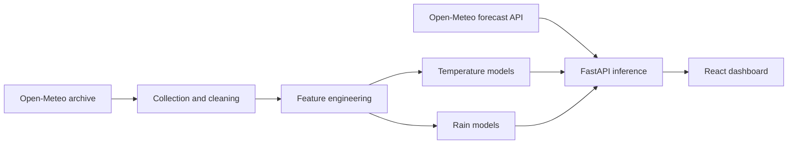

# SkyCast AI

SkyCast AI is an end-to-end research project for short-range Bangalore weather forecasting. It collects and prepares 2015–2025 Open-Meteo observations, engineers leakage-safe hourly features, trains temperature and rain models, exposes predictions through FastAPI, and presents them in a responsive React dashboard.

## Architecture



```text
skycast-ai/
├── backend/                 FastAPI app, API tests, container, environment example
├── data/                    Generated raw and processed weather data
├── demo/                    Valid 169-hour example prediction request
├── docs/screenshots/        Release screenshot placeholders
├── frontend/                React, Vite, TypeScript, Axios and Recharts dashboard
├── models/                  Generated baseline, advanced and rain model artifacts
├── reports/                 Generated metrics and diagnostic figures
├── src/                     Data, features, training and evaluation modules
├── tests/                   Data and model test suites
├── docker-compose.yml       Local production-style stack
├── render.yaml              Render backend blueprint
└── requirements.txt         Data and model development dependencies
```

The API imports `src.features.create_features`, so Bengaluru inference uses the same lag, rolling and calendar calculations as training. On page load, the frontend fetches 169 live records from Open-Meteo. The location search is proxied through FastAPI; selecting a result refreshes every live panel with the selected coordinates and timezone. Bengaluru uses the trained SkyCast models, while other locations use clearly labelled Open-Meteo outlook data because the current trained artifacts are Bangalore-specific. Its API base URL is injected with `VITE_API_BASE_URL`.

## Features

- Hourly Bangalore data collection from the Open-Meteo Historical Weather API with retries, timeouts and validation.
- Small-gap interpolation without silently filling long missing periods.
- Chronological train (2015–2022), validation (2023–2024) and test (2025) splits with no shuffling.
- Leakage-safe calendar, lag and past-only rolling features.
- Temperature forecasts and rain probability/amount forecasts at 1h, 6h, 12h and 24h.
- FastAPI validation, lazy model loading, liveness/readiness endpoints, clear 422/500/503 responses and configurable CORS.
- Responsive React dashboard with a pill-shaped location search, automatic live Open-Meteo history loading, location-aware charts/radar/sun and moon/environment/news panels, and loading/error/retry states.
- Docker Compose, Render and Vercel configuration.

## Model results

Best temperature models on the 2025 test set:

| Horizon | Model | MAE (°C) | RMSE (°C) | R² |
| --- | --- | ---: | ---: | ---: |
| 1h | Random Forest | 0.3442 | 0.5630 | 0.9809 |
| 6h | Random Forest | 0.7341 | 1.0172 | 0.9377 |
| 12h | Random Forest | 0.7652 | 1.0626 | 0.9320 |
| 24h | HistGradientBoosting | 0.7906 | 1.1084 | 0.9260 |

Best rain classifiers on the 2025 test set:

| Horizon | Model | Precision | Recall | F1 | ROC-AUC | Brier |
| --- | --- | ---: | ---: | ---: | ---: | ---: |
| 1h | HistGradientBoosting | 0.7190 | 0.7720 | 0.7446 | 0.9423 | 0.0937 |
| 6h | HistGradientBoosting | 0.8113 | 0.8459 | 0.8282 | 0.9422 | 0.0941 |
| 12h | HistGradientBoosting | 0.8732 | 0.8639 | 0.8686 | 0.9469 | 0.0904 |
| 24h | Random Forest | 0.9040 | 0.9095 | 0.9068 | 0.9484 | 0.0859 |

The HistGradientBoosting rainfall regressors achieved MAE values of 0.1319, 0.6734, 1.2983 and 2.3945 mm for 1h, 6h, 12h and 24h respectively. Rainfall amount is the hardest task: its test R² ranges from 0.19 to 0.29.

## Local setup

Python 3.11 or newer and Node.js 22 or newer are recommended. On Windows PowerShell:

```powershell
py -3.11 -m venv .venv
.\.venv\Scripts\Activate.ps1
python -m pip install --upgrade pip
python -m pip install -r requirements.txt
python -m pip install -r backend/requirements.txt
Copy-Item backend/.env.example backend/.env
Copy-Item frontend/.env.example frontend/.env
```

If PowerShell blocks activation, first run `Set-ExecutionPolicy -Scope Process -ExecutionPolicy Bypass`. If it blocks `npm.ps1`, use `npm.cmd` in place of `npm`.

Run the data and model pipeline when the generated artifacts are not already present:

```powershell
python -m src.collect_data
python -m src.clean_data
python -m src.features
python -m src.train_baselines
python -m src.evaluate
python -m src.train_advanced_models
python -m src.compare_models
python -m src.train_rain_models
python -m src.evaluate_rain_models
```

Start the backend from the project root:

```powershell
uvicorn backend.app.main:app --reload --env-file backend/.env
```

In another terminal, start the dashboard:

```powershell
cd frontend
npm install
npm run dev
```

Open `http://localhost:5173`. The dashboard automatically loads recent Bengaluru observations from Open-Meteo and generates four SkyCast horizons. Use the upper-right search field to load a different location; all live panels switch to that place and its local timezone.

## Verification

```powershell
pytest
uvicorn backend.app.main:app
cd frontend
npm test
npm run lint
npm run build
```

The Vite production output is generated under `frontend/dist/` and is intentionally ignored.

## Docker

The Compose build uses the trained artifacts in the local `models/` directory. By default, Nginx proxies the dashboard's same-origin `/api` requests to the backend container, so browser clients do not need to resolve a separate backend host:

```powershell
docker compose up --build
```

Then open `http://localhost:5173`; the API is available at `http://localhost:8000`. Check container state with `docker compose ps`, and stop the stack with `docker compose down`.

For a non-local API URL, set `VITE_API_BASE_URL` before building. For a different frontend origin, set `SKYCAST_CORS_ORIGINS` before starting Compose.

## API usage

| Endpoint | Purpose |
| --- | --- |
| `GET /health` | Lightweight liveness check; remains available if model files are missing. |
| `GET /health/ready` | Loads and verifies all 12 selected artifacts; returns 503 when unavailable. |
| `GET /models` | Lists the selected temperature, classifier and rainfall artifacts. |
| `GET /api/locations?query=...` | Searches Open-Meteo's geocoding service for selectable locations. |
| `GET /api/observations` | Fetches, validates and caches recent Open-Meteo records for the selected coordinates and timezone. |
| `GET /api/environment` | Returns location-specific air quality, dust, and UV conditions. |
| `GET /api/climate-news` | Returns cached climate and weather topics for the selected location. |
| `POST /predict` | Returns four temperature, rain probability and rainfall forecasts. |

Prediction requests require at least 169 unique, contiguous hourly observations. Naive timestamps are treated as `Asia/Kolkata`; offset-aware values are converted to it.

```bash
curl -X POST http://localhost:8000/predict \
  -H "Content-Type: application/json" \
  --data-binary @demo/bangalore_recent_observations.json
```

Example response shape:

```json
{
  "location": "Bangalore",
  "generated_at": "2026-07-16T00:03:23.122563Z",
  "forecasts": [
    {
      "horizon_hours": 1,
      "temperature_c": 20.64,
      "rain_probability": 0.166,
      "rain_expected": false,
      "rainfall_mm": 0.019
    }
  ]
}
```

Open `http://localhost:8000/docs` for the interactive OpenAPI documentation.

## Deployment

### Render backend

1. Make the 12 selected `.joblib` artifacts available to the Docker build. They are generated and ignored by default; use Git LFS or an approved artifact-delivery process rather than regular Git blobs.
2. Push the repository to GitHub and create a Render Blueprint from `render.yaml`.
3. Set `SKYCAST_CORS_ORIGINS` to the exact Vercel production URL. Optionally set `SKYCAST_CORS_ORIGIN_REGEX` for Vercel preview domains.
4. Deploy and verify `https://<service>.onrender.com/health` and `/health/ready`.

Render supplies `PORT`; the container binds Uvicorn to `0.0.0.0` on that value. The Blueprint uses `/health` as the platform health check so missing artifacts can be diagnosed through `/health/ready` and logs.

### Vercel frontend

1. Import the GitHub repository and set the Vercel root directory to `frontend`.
2. Add `VITE_API_BASE_URL=https://<service>.onrender.com` for Production and Preview environments.
3. Deploy with the included `frontend/vercel.json` configuration.
4. Add the final Vercel URL to the backend CORS allowlist and redeploy the backend if needed.
5. Verify `https://<site>.vercel.app/health`, backend status in the header, and one demo prediction.

`VITE_API_BASE_URL` is a public build-time value. Do not put secrets in any `VITE_*` variable.

## Project demo and screenshots

The demo path is deliberately short: start both services and open the dashboard. It fetches recent Open-Meteo history, displays the latest conditions, and automatically renders the location-specific outlook. Use the search field in the upper-right corner to switch cities; all dashboard panels, charts, radar, environmental readings, sunrise/sunset details, and news refresh for the selected place.

Screenshot slots are reserved in `docs/screenshots/README.md` for:

- Desktop dashboard
- Mobile dashboard
- FastAPI OpenAPI documentation

## Generated files and version control

Raw/processed CSVs, trained `.joblib` artifacts, metric reports, figures, Python caches, `node_modules` and frontend builds are generated locally and ignored. Empty model/data directories can be retained with `.gitkeep`. The committed demo JSON is a small, valid extract from the processed 2025 observations; it is not synthetic weather data.

No credentials are required by the application. Keep local `.env` files out of Git and commit only `.env.example` templates.

## Limitations

- Live observations depend on Open-Meteo availability; the backend returns a clear error and the dashboard offers retry if the service cannot provide a valid 169-hour history.
- The deployment cannot make predictions until the selected model artifacts are delivered to the backend image or mounted model directory.
- Three selected Random Forest temperature files make the production artifact set roughly 198 MB and increase cold-start memory/time.
- Open-Meteo data is cached for 60 minutes, so it is not minute-by-minute live weather.
- The trained SkyCast temperature and rain artifacts are calibrated only for Bengaluru. Other searched locations intentionally use Open-Meteo live outlook data instead of an invalid model inference.
- Rainfall amount accuracy is modest, especially at longer horizons.
- There is no authentication, rate limiting, persistent request storage or automated retraining.
- This is a research demonstration, not a source for safety-critical weather decisions.
